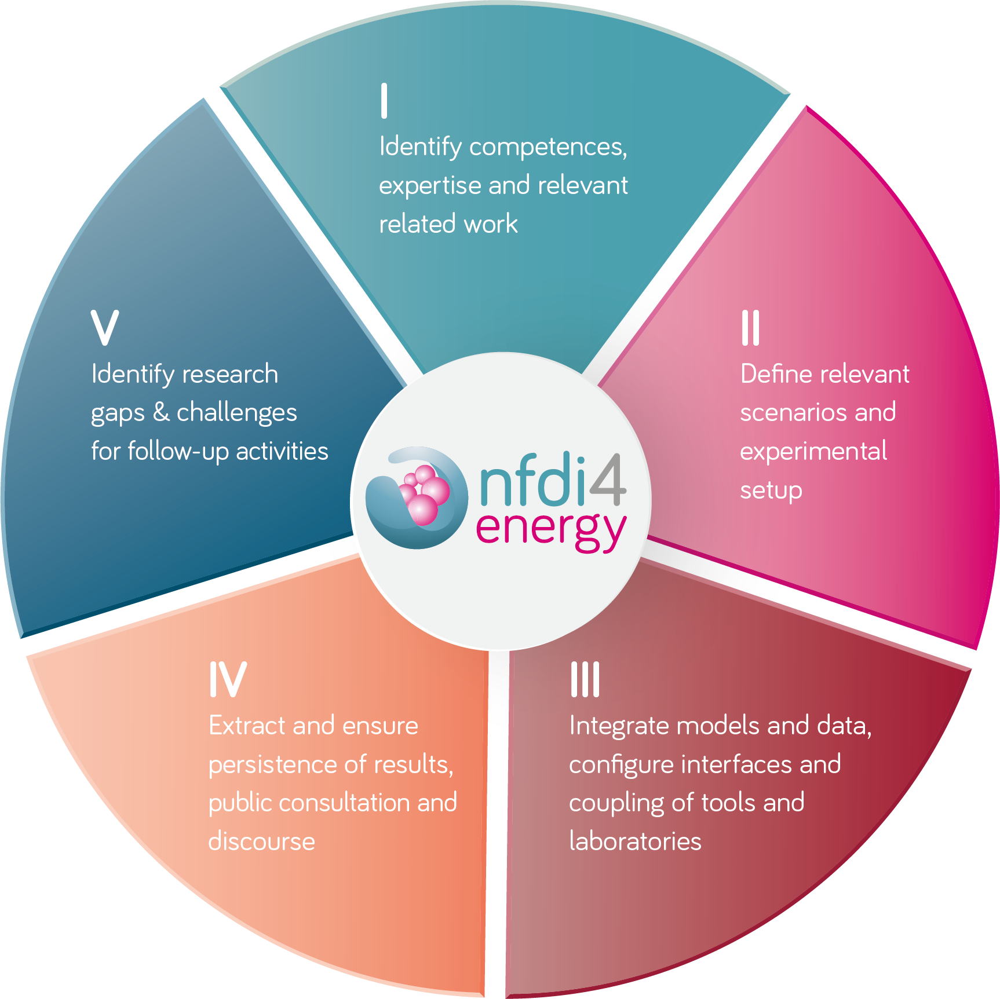

# Services from NFDI4Energy
In the NFDI4Energy [proposal](https://zenodo.org/records/6772013), a Research & Tranfser Cycle is defined. It introduces the following key services:

<figure markdown="span">
  {width="50%" }
  <figcaption>Research & Transfer Cycle from the NFDI4Energy proposal.</figcaption>
</figure>

Based on this Research & Tranfser Cycle, **Core Services** are defined:

| Category       | Definition                                                                                                                                                           |
|----------------|----------------------------------------------------------------------------------------------------------------------------------------------------------------------|
| Competence     | help to navigate the interdisciplinary research field                                                                                                                |
| Best Practices | get information on successful conduct of research in the field of energy systems and their research data management                                                  |
| Registry       | find suitable data sets and software modules                                                                                                                         |
| Simulation     | couple existing simulations and, therefore, increase the reuse of software artefacts                                                                                 |
| Transparency   | involve more stakeholders in all research stages, especially integrating their data, and to convey the appropriate key research results to all relevant stakeholders |