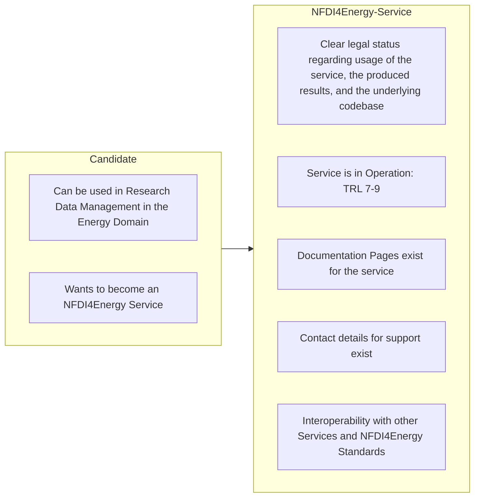

# About

## What is a service?
Closely alligned with the [NFDI defintion](https://zenodo.org/records/10101412), we define a service as follows:

!!! note "Definition"

    A service is a technical-oganisational solution that typically offers

    * ☁️ storage and computing services
    * 🔁 software, processes and workflows
    * ☎️ support for service desk

    ... with different levels of technicity.

## What is an NFDI4Energy Service?
An NFDI4Energy Service is a service based on the definition above. Moreover, it targets the two domains of "Research Data Management" and "Energy Domain".

## How can my service become an NFDI4Energy Service?
Right now we distinguish between two stages: `Candidates` and full `NFDI4Energy Services`. A `Candidate` needs to fulfill two requirements. First, it needs to be a Service as defined above. And second, it needs to target the area of Research Data Management in the Energy Domain. 

The goal for every Candidate Service is to become a full `NFDI4Energy Service`. Therefore, a few more requirements have to be met.

* A clear legal status for all relevant aspects are needed. First, a Terms of Service needs to clarify how the service can be used. Second, if the service produces or provides data of some kind, it needs to be clarified how this data can be used. And third, if the codebase of the service is open-source, it needs to have a license attached.
* The service needs to be in operation - it needs to be more than a prototype. We think that a [Technology Readiness Level](https://en.wikipedia.org/wiki/Technology_readiness_level) of 7 or above is required.
* The service needs to be documented. It is great if tutorials are provided within the `Best Practice` module of NFDI4Energy. If the underlying code of the service is open-source, this code also needs a documentation.
* A support needs to be available for users. This means, that there is at least an email adress available for users seeking support.
* The service needs to be interoperable with relevant other services and relevant standards. The specific meaning of this is to be decided case by case. The developers and stakeholders from NFDI4Energy will define all relevant standards and other services that are relevant. 

??? note "You think a requirement is missing here?"

    Discuss requirements with us, either via mail service[@]nfdi4energy.org or in the [github issue](https://github.com/NFDI4Energy/service-portfolio/issues/2).

## How are services categorized?

### Categorization based on the `Data Life Cycle`

Data Services are tools that help researchers in one or multiple steps of the Research Data Management Life Cycle. Hence, services can get one or multiple of the tags [planning](categories.md/#dlcplanning), [production](categories.md/#dlcproduction), [analysis](categories.md/#dlcanalysis), [storage](categories.md/#dlcstorage), [access](categories.md/#dlcaccess), and [re-use](categories.md/#dlcre-use). Additionally, [Services for developers](categories.md/#dev) can help developers to build services.

<figure markdown="span">
  {width="50%" }
  <figcaption>Research Data Management Life Cycle.</figcaption>
</figure>

### Categorization based on the DFG Definitions
These categories are relevant for the DFG reporting. They can be accessed from the nfdi1000 Excel sheet [here](https://www.dfg.de/de/foerderung/foerderinitiativen/nfdi/formulare-merkblaetter) and the [Guide](https://www.dfg.de/en/research-funding/funding-initiative/nfdi/guide-to-filling-out-the-supplementary-data-sheet-for-consortia-of-the-national-research-data-infrastructure-nfdi-)

First, Categories are defined based on the [de.NBI](https://zenodo.org/records/6597826) definitions (see Drop Down Categories from the reporting excel sheet, Tab 5)

| Category             | Definition                                                                                                                                                 |
|----------------------|------------------------------------------------------------------------------------------------------------------------------------------------------------|
| Database             | software providing large amounts of structured data to the user. Usually the data can be uploaded, accessed, searched and/or downloaded via a web browser. |
| Library / API        | collection of pre‐implemented functions for a specific task that can be accessed via a well‐ defined interfaces.                                           |
| Workflow             | software that combines multiple tools / applications. They may be used locally or remotely via the internet.                                               |
| Tools / applications | software that can be downloaded and executed locally on the users' hardware.                                                                               |
| Web applications     | software that is installed on a server and can be used by users via a web page and the internet.                                                           |
| Storage              | Not defined by de.NBI                                                                                                                                      |
| Data Curation        | Not defined by de.NBI                                                                                                                                      |

de.NBI additionally defines `Support / consulting` as "service with direct user contact for topics going beyond the support for the other services".

### Categorization based on the DFG Service Descriptions
The DFG Reporting asks for the state of the software. We map these states to TLR levels, where we follow the [Criteria for Basic Services](https://base4nfdi.de/process/criteria-for-basic-services) from base4nfdi.

| DFG Service Description | Technology Readiness Level TLR |
|-------------------------|--------------------------------|
| Development             | 1-4                            |
| Prototype               | 5-6                            |
| Operation               | 7-9                            |
| Terminated              |                                |
