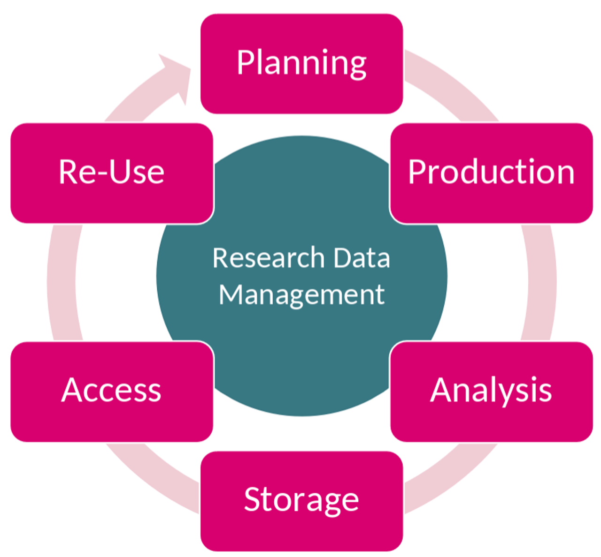

# Energy Research Data Management Service Portfolio
This site collects data services that are relevant in the energy domain. To appear in this Collection, the following criteria are used:

* The Service targets the german energy sector.
* The Service targets one or multiple steps in the `Data Life Cycle`.
* The Service already complies with the FAIR criteria or it is aiming to do so in the future.

## Categorization of Services

### Categorization based on the `Data Life Cycle`

Data Services are tools that help researchers in one or multiple steps of the Research Data Management Life Cycle. Hence, services can get one or multiple of the tags [planning](NFDI4EnergyServices/index.md#dlcplanning), [production](NFDI4EnergyServices/index.md#dlcproduction), [analysis](NFDI4EnergyServices/index.md#dlcanalysis), [storage](NFDI4EnergyServices/index.md#dlcstorage), [access](NFDI4EnergyServices/index.md#dlcaccess), and [re-use](NFDI4EnergyServices/index.md#dlcre-use).

<figure markdown="span">
  {width="50%" }
  <figcaption>Research Data Management Life Cycle.</figcaption>
</figure>

### Categorization based on the DFG Definitions
These categories are relevant for the DFG reporting. They can be accessed from the nfdi1000 Excel sheet [here](https://www.dfg.de/de/foerderung/foerderinitiativen/nfdi/formulare-merkblaetter) and the [Guide](https://www.dfg.de/en/research-funding/funding-initiative/nfdi/guide-to-filling-out-the-supplementary-data-sheet-for-consortia-of-the-national-research-data-infrastructure-nfdi-)

First, Categories are defined based on the [de.NBI](https://zenodo.org/records/6597826) definitions (see Drop Down Categories from the reporting excel sheet, Tab 5)

| Category             | Definition                                                                                                                                                 |
|----------------------|------------------------------------------------------------------------------------------------------------------------------------------------------------|
| Database             | software providing large amounts of structured data to the user. Usually the data can be uploaded, accessed, searched and/or downloaded via a web browser. |
| Library / API        | collection of pre‐implemented functions for a specific task that can be accessed via a well‐ defined interfaces.                                           |
| Workflow             | software that combines multiple tools / applications. They may be used locally or remotely via the internet.                                               |
| Tools / applications | software that can be downloaded and executed locally on the users' hardware.                                                                               |
| Web applications     | software that is installed on a server and can be used by users via a web page and the internet.                                                           |
| Storage              | Not defined by de.NBI                                                                                                                                      |
| Data Curation        | Not defined by de.NBI                                                                                                                                      |

de.NBI additionally defines `Support / consulting` as "service with direct user contact for topics going beyond the support for the other services".

### Categorization based on the DFG Service Descriptions
The DFG Reporting asks for the state of the software. We map these states to TLR levels, where we follow the [Criteria for Basic Services](https://base4nfdi.de/process/criteria-for-basic-services) from base4nfdi.

| DFG Service Description | Technology Readiness Level TLR |
|-------------------------|--------------------------------|
| Development             | 1-4                            |
| Prototype               | 5-6                            |
| Operation               | 7-9                            |
| Terminated              |                                |

Is the software open-source? If yes, add the tag

* open-source

